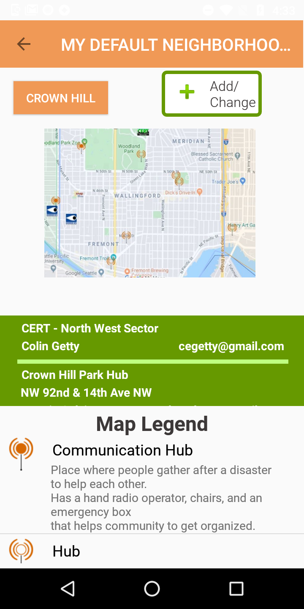
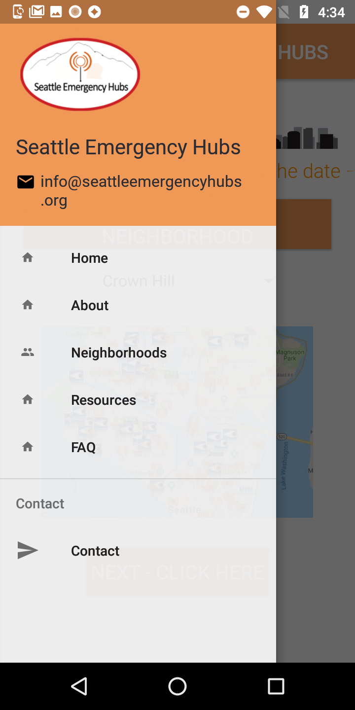
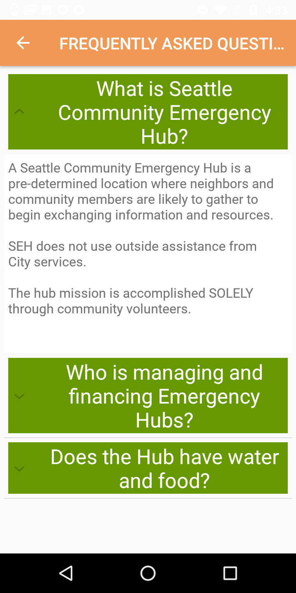

# AD430-Seattle-Emergency-Hubs

### This is an Android App where folks can find the Emergency Communication Hubs.

Hubs are just meeting spots where neighbors will naturally gather to help one another post-disaster.
Some of them have volunteers who have gotten organized and prepositioned supplies to help neighbors exchange information.  Of the sites that are organized, many of them have a box that looks like the attached photo.

##### Google Firebase database was created to store information about hubs.
##### The application retrieves Hubs information from Google Firebase database.
##### User selects a neighborhood on the main page and his selection is saved untill the next time app is opened.
##### After choosing a neighborhood, the user can see the closest available emergency hubs and their types in the Neighborhoods activity.
##### The selected neighborhood information will be displayed even if all signals and wifi connections are lost, which is likely in the event of major earthquake.

## Application Main Page

## Selected neighborhood Page
#### Displays nearest emergency hubs, their type, hub captain and contact information

## Navigation

## Frequently Asked Questions Expandable Pop UPs

http://seattleemergencyhubs.org/seattle-emergency-neighborlink-map/
Seattle Emergency NeighborLink Map | Seattle Emergency Hubs | Seattle, WA
Make your mark on preparedness Add yourself to the Seattle Emergency NeighborLink map!! If you are a current or new SNAP Coordinator, Block Watch Captain, Hub Captain or CERT Member, and want to know who else has organized their neighbors for safety or disaster, this is your opportunity to connect with others BEFORE a happens.
seattleemergencyhubs.org
Hubs are just meeting spots where neighbors will naturally gather to help one another post-disaster.  Some of them have volunteers who have gotten organized and prepositioned supplies to help neighbors exchange information.  Of the sites that are organized, many of them have a box that looks like the attached photo.

We anticipate the internet and all cell phone signal to be down after a big earthquake so folks need to use the app and identify (and store) the Hub closest to home and work before anything happens.  
